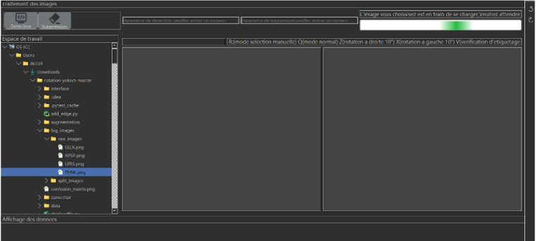
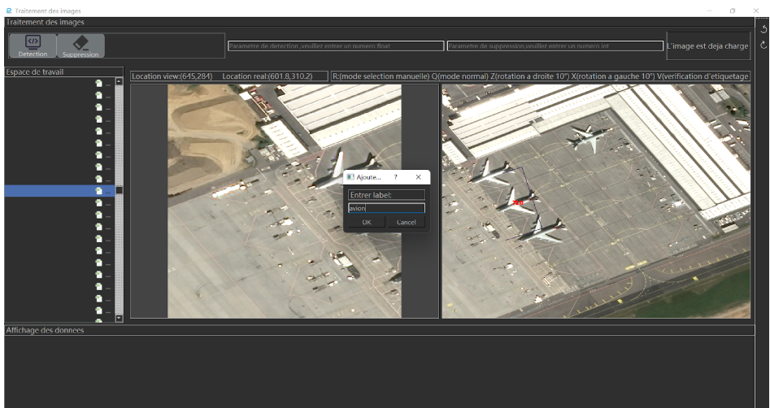
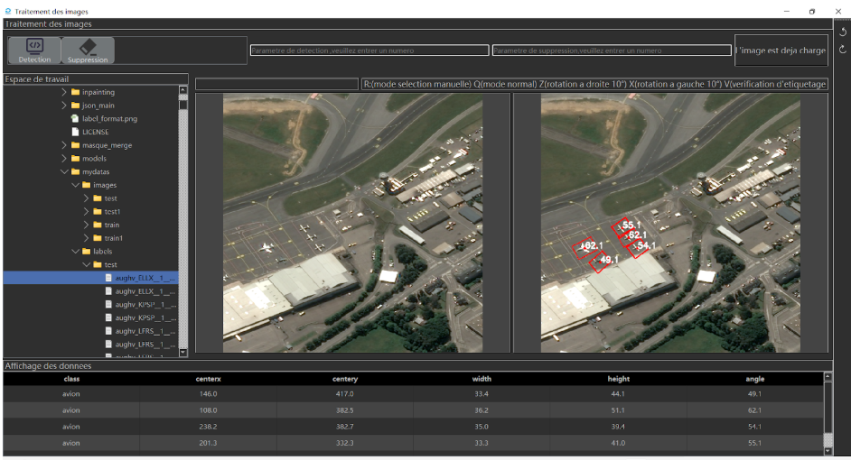
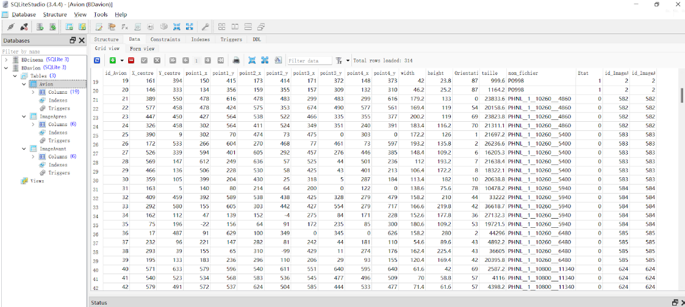

---

# Détection et Suppression Automatique d'Avions dans les Images Satellites

Ce projet utilise YOLOv5 et des techniques de traitement d'images pour détecter, supprimer et remplacer automatiquement des avions dans des images satellites. Il est conçu pour être utilisé avec une interface graphique PyQt5, facilitant l'interaction avec l'utilisateur.

## Demonstration d'interface
###Cliquez sur l'image pour télécharger la vidéo de démonstration
[](https://github.com/frankxm/Interface_yolo_inpainting/raw/main/video/demonstration.mp4)


###Detection

###Annotation

###Visualisation 

###base de données


## Liens des Programmes Exécutables

- **Windows** : [Télécharger l'exécutable PyQt5 pour Windows](https://drive.google.com/drive/folders/1ddQhAtdIlmadTS-HKMH3VyulmMJ1E9gg?usp=sharing)
- **Linux** : [Télécharger l'exécutable PyQt5 pour Linux](https://drive.google.com/drive/folders/1pnjM3ykEtG59gQHAUvd3X5KOT0qcq727?usp=sharing)

## Fichiers Principaux

- **`mainapp.py`** : Démarrage de l'interface PyQt5.
- **`detect.py`** : Inférence avec le modèle entraîné sur les images satellites (`best.pt`).
- **`inpainting_last.py/inpainting`** : Suppression et remplacement des pixels des avions dans l'image
-  **`BDavion.db`**:La base de données SQLite qui est créée après le lancement de l'interface et modifiée après les étapes "prediction" et "suppression".

## Structure des Dossiers

### `models/`
Ce dossier contient la structure, la définition et l'exportation des modèles. Il constitue la partie centrale de YOLOv5 et est responsable de la construction et de l'exécution des modèles de réseaux neuronaux.

### `utils/`
Ce dossier contient des fonctions utilitaires pour le traitement des données, l'évaluation, la visualisation et d'autres outils nécessaires pour optimiser le processus de formation et d'inférence. Ces fonctions sont essentielles lors de l'exécution de `detect.py`.

### `inference/`
#### `output/`
- **Stocke les images après la prédiction.**
- **`labels/`** : Contient les fichiers de sortie des prédictions.  
Exemple de format de sortie :

    ```
    aughv_ELLX__1__8640___3780 0.51 489.0 548.0 481 611 548 571 496 484 429 524 102.0 78.0 59.0 D:\python_pycharm\rotation-yolov5-master\mydatas\images\test\aughv_ELLX__1__8640___3780.png inference/output/aughv_ELLX__1__8640___3780.png 640 640
    ```

    Ce fichier contient :
    - Nom de l'image
    - Confiance du rectangle prédit
    - Point central du rectangle prédit
    - Quatre sommets du rectangle prédit
    - Largeur et hauteur du rectangle prédit
    - Informations d'angle du rectangle prédit
    - Chemin de l'image d'origine
    - Chemin de l'image prédite
    - Largeur et hauteur de l'image

#### `masks/`
- Contient les masques d’images satellites générés après prédiction.

### `big_images/split_images`
- Si la taille de l'image à prédire est trop grande, elle est découpée en petites images et stockée ici pour être traitée plus facilement.

### `icons/`
- Contient les icônes utilisées par l'interface graphique.

### `inpainting/`
#### `images/`
- Contient les images satellites qui doivent être restaurées. Si l'image d'entrée est trop grande, elle est découpée en plusieurs images pour une prédiction par morceaux.

#### `mask/`
- Masques des images satellites avant restauration.

#### `result/`
- Résultats des images satellites après restauration.

#### `combinedinpainting/`
- Image grande fusionnée après la restauration des petites images satellites.

#### `combinedimages/`
- Image grande fusionnée après la prédiction des petites images satellites.

#### `combinedmasks/`
- Masque d'image grande fusionnée après la prédiction des petites images satellites.

## Entraînement du Modèle YOLOv5 Rotation

Le modèle YOLOv5 Rotation utilisé pour la détection d'objets dans des images satellites avec une approche de détection d'objets en boîte orientée. Pour entraîner votre propre modèle, vous pouvez suivre les instructions disponibles sur ce lien :

- [Entraîner le modèle YOLOv5 Rotation](https://github.com/hukaixuan19970627/yolov5_obb)


## Source images

- [Cliquez ici pour obtenir les grandes images et regarder les resultats de suppression](https://drive.google.com/drive/folders/1fxVfwN7UA1wFeUGGyLodHtEEDi3dXJ35?usp=sharing)

